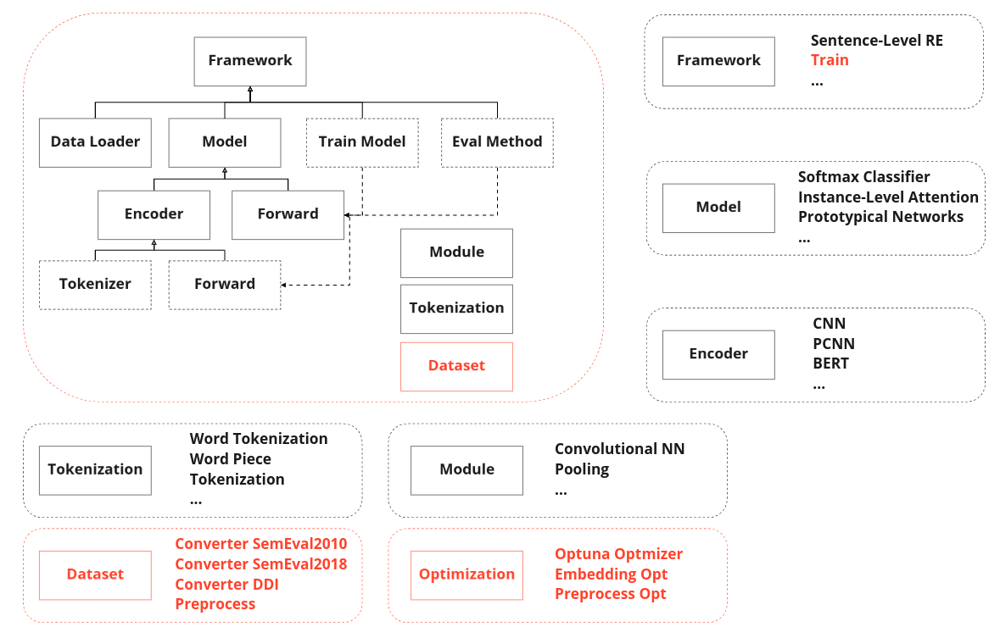
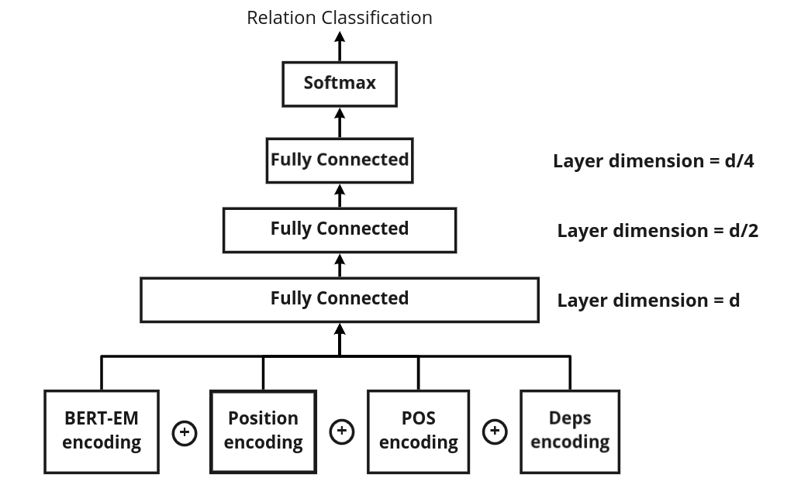

# DeepREF: A Framework for Optimized Deep Learning-based Relation Classification

## What is Relation Classification

Relation extraction is a natural language processing (NLP) task aiming at classifying relations (e.g., *founder of*) between entities (e.g., **Bill Gates** and **Microsoft**). For example, from the sentence *Bill Gates founded Microsoft*, we can classify the relation triple **Bill Gates** and **Microsoft** as *founder of*, . 

Relation classification is a crucial technique in automatic knowledge graph construction. By using relation classification, we can accumulatively classify new relation facts and expand the knowledge graph, which, as a way for machines to understand the human world, has many downstream applications like question answering, recommender system and search engine. 

## How to cite
```
@inproceedings{nascimento-etal-2022-deepref,
    title = "{D}eep{REF}: A Framework for Optimized Deep Learning-based Relation Classification",
    author = "Nascimento, Igor  and
      Lima, Rinaldo  and
      Chifu, Adrian-Gabriel  and
      Espinasse, Bernard  and
      Fournier, S{\'e}bastien",
    booktitle = "Proceedings of the Thirteenth Language Resources and Evaluation Conference",
    month = jun,
    year = "2022",
    address = "Marseille, France",
    publisher = "European Language Resources Association",
    url = "https://aclanthology.org/2022.lrec-1.480",
    pages = "4513--4522",
    abstract = "The Relation Extraction (RE) is an important basic Natural Language Processing (NLP) for many applications, such as search engines, recommender systems, question-answering systems and others. There are many studies in this subarea of NLP that continue to be explored, such as SemEval campaigns (2010 to 2018), or DDI Extraction (2013).For more than ten years, different RE systems using mainly statistical models have been proposed as well as the frameworks to develop them. This paper focuses on frameworks allowing to develop such RE systems using deep learning models. Such frameworks should make it possible to reproduce experiments of various deep learning models and pre-processing techniques proposed in various publications. Currently, there are very few frameworks of this type, and we propose a new open and optimizable framework, called DeepREF, which is inspired by the OpenNRE and REflex existing frameworks. DeepREF allows the employment of various deep learning models, to optimize their use, to identify the best inputs and to get better results with each data set for RE and compare with other experiments, making ablation studies possible. The DeepREF Framework is evaluated on several reference corpora from various application domains.",
}
```
### Using Git Repository

Clone the repository from our github page (don`t forget to star us!)

```bash
git clone https://github.com/igorvlnascimento/DeepREF.git
```

Then install all the requirements:

```
pip install -r requirements.txt
```

Then install the package with 
```
python setup.py develop
```

## DeepREF Framework Architecture


## DeepREF Classes Diagram



The framework code base was made upon the OpenNRE toolkit. The lines in black are the preexistent modules in OpenNRE. The red lines are new modules added to the DeepREF. Some of the new modules came from REflex. The Dataset module has all the scripts necessary to convert a dataset to .csv file in a standard format to further preprocessing. 

If you want to convert a new dataset, you have to create a converter file and put in this module. The optimization module has all the scripts necessary to findthe best combination of dataset preprocessing, embeddings and hyperparameters.

The other modules in black is explained on OpenNRE [paper](https://aclanthology.org/D19-3029.pdf). There is a file named `train.py` that can train any model and it was inserted on Framework module. This file will be explained later in this docs.

## Simple Deep Neural Network Architecture in DeepREF

This is the best model architecture available in the framework:



The POS and Deps encoding are optional and you can turn it off in `pos_embed` and `deps_embed` variables, respectively. This variables can be found in `deepref/data/hyperparams_<dataset>.json` file. 

## Optimization

### Hyperparameters/Model optimization

To optimize hyperparameters or models, execute the following code:
```
python deepref/optimization/bo_optimizer.py -d <dataset> -m <metric> -t <trials_number>
```
You can replace the following tags by:

`<dataset>`: `semeval2010` (default), `semeval20181-1`, `semeval20181-2` and `ddi`;

`<metric>`: `micro_f1` (default), `macro_f1` and `acc`;

`<trials_number>`: any integer.


Even if you don`t have any datasets preprocessed, the code above can automatically download and preprocess the dataset for you on the fly.

The first two are the datasets and metrics already explained above. The `-t` arg means the number of trials that Optuna needs to execute to find the best combination of parameters. If you want to choose another model to test on the framework, you only need to change the `model` variable in the file 

## Training

Make sure you have installed DeepREF as instructed above. Then import our package and load pre-trained models.

If you want to train one or a few models, try this:
```
python deepref/framework/train.py --dataset <dataset>
```

Even if you don`t have any datasets preprocessed, the code above can automatically download and preprocess the dataset for you on the fly.

That code will get the hyperparameters, embeddings and preprocessing types from `deepref/hyperparameters/hyperparams_<dataset>.json`. If this file doesn't exist, it will create it automatically with default values. This file contains the best hyperparameters, embeddings and preprocessing type for such dataset. You can change the values manually to get a different result. The list of possible values you can use to test can be seen on `deepref/config.py`. You can see the results in the file `results/<dataset>/ResultsDeepREF_<dataset>_<datetime>.txt`. It can take about 20 minutes to execute the training on Colab Pro+ using `GPU` and `High RAM`.

## Preprocessing

It's easy to preprocess the datasets on DeepREF. Just execute the code below to train a model and choose the preprocessing types on the variable `preprocessing` in the `deepref/hyperparameters/hyperparams_<dataset>.json` file.

```
python deefref/framework/train.py --dataset <dataset_name>
```

The `dataset_name` can be one of theses options: `semeval2010` (default), `semeval20181-1`, `semeval20181-2` and `ddi`.

This code will get the dataset .csv file in the framework in the standard format and preprocess it with the preprocessing types specified on `deepref/hyperparameters/hyperparams_<dataset>.json` file. The preprocessing types can be a combination of `eb` (entity blinding), `nb` (NER blinding), `d` (digit blinding), `b` (text between brackets or parenthesis removal), `p` (punctuation removal) and `sw` (stopwords removal). The preprocessing variable on `deepref/hyperparameters/hyperparams_<dataset>.json` file is a list with the preprocessing string types choosen above.

If you didin't downloaded tand converted the dataset, execute the following:
```
bash benchmark/download_<dataset_name>.sh
```

You can change the NLP tool and NLP model doing the following:
```
NLP_TOOL=spacy
export NLP_TOOL
NLP_MODEL=en_core_web_sm
export NLP_MODEL
```
There are 2 NLP tools available in the framework: SpaCy and Stanza. SpaCy is faster than Stanza to process text.

## New Models Architecture / Datasets

### Models Architectures

If you want to add a new architecture to the framework, first, create a encoder to this new architecture and add this to `deepref/framework/train.py` with a name to identify the model. Second, remember to add the encoder name in the `encoder/\__init\__.py`. Third, add this model name to the `MODELS` variable on `deepref/config.py` file.

### Datasets

To add a new dataset you have it's important to create a new .sh file on `benchmark` folder to download the dataset named `download_<dataset_name>.sh`. Follow the other preexistent .sh scripts to create a new one. After this, create a class converter inheriting from `DatasetConverter` in the format `<dataset>_converter.py` to the dataset in `deepref/dataset/converters` directory to transform the downloaded dataset into a .csv file in a standard format to preprocess and generate .txt to train in the framework. Follow the other preexistent .py scripts to converter a custom dataset. You have to tag the sentences in the dataset and return this tagged sentence and the relation type associated using a generator (with `yield`). So, you have to only override the methods `get_etity_dict`, that returns a dictionary with the `id` as a key and, the entity `word`and the indexes where begin the entity starts and finishes, and the method `get_sentences`tha return a generator with the tagged sentence with head and tail entity and the relation type of this sentence. 

Add the dataset name to the `DATASETS` list on `deepref/config.py` file. 
