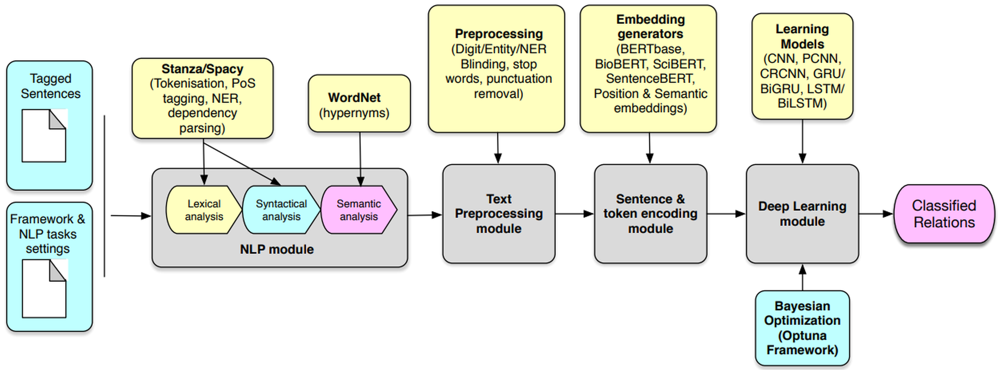

# DeepREF: A Framework for Optimized Deep Learning-based Relation Classification

## What is Relation Classification

Relation extraction is a natural language processing (NLP) task aiming at classifying relations (e.g., *founder of*) between entities (e.g., **Bill Gates** and **Microsoft**). For example, from the sentence *Bill Gates founded Microsoft*, we can classify the relation triple **Bill Gates** and **Microsoft** as *founder of*, . 

Relation classification is a crucial technique in automatic knowledge graph construction. By using relation classification, we can accumulatively classify new relation facts and expand the knowledge graph, which, as a way for machines to understand the human world, has many downstream applications like question answering, recommender system and search engine. 

## DeepREF Framework Architecture



### Using Git Repository

Clone the repository from our github page (don`t forget to star us!)

```bash
git clone https://github.com/igorvlnascimento/DeepREF.git
```

Then install all the requirements:

```
pip install -r requirements.txt
```

Then install the package with 
```
python setup.py install
```

## Preprocessing

It`s easy to preprocess the datasets on DeepREF. Just execute the code below:

```
python opennre/dataset/preprocess_dataset.py -d <dataset>
```

Dataset can be one of theses options: `semeval2010` (default), `semeval20181-1`, `semeval20181-2` and `ddi`.

This code will download the dataset, transform into a .csv file in a standard format and preprocess it to the preprocessing types specified on . The preprocessing types can be a combination of `eb` (entity blinding), `nb` (NER blinding), `d` (digit blinding), `b` (text between brackets or parenthesis removal), `p` (punctuation removal) and `sw` (stopwords removal). If you leave the `-p` in blank, it will make all possible combination  with theses preprocessing types. 

For example, if yu do this:
```
python opennre/dataset/preprocess_dataset.py -d semeval2010
```

It will download SemEval 2010 dataset, if it doesn't exists in the framework, transform to a .csv file in a standard format and preprocess dataset to the specified preprocessing type on `opennre/data/best_hparams_<dataset>.json` file. It gets the prepocessing value in this file which is an integer. This integer is the preprocessing combination index for the `PREPROCESSING_COMBINATION` list on `opennre/config.py` file.

If you wants to only download the dataset directly and transform it to a .csv file in a standard format, execute the following:
```
bash benchmark/download_<dataset>.sh
```

You can change the NLP tool and NLP model from `opennre/data/best_hparams_<dataset>.json` file. The `nlp_tool` can be only `stanza` or `spacy` and `nlp_tool_type` is `general` or `scientific`. The `general` type loads a more general model for Stanza or SpaCy and the `scientific` loads the biomedical model for Stanza and the smae general model for SpaCy. The file `opennre/data/nlp_config.py` has the NLP tool and model configuration. You can add new NLP models to this file. Don't forget to add to `NLP_MODELS` variable on `opennre/config.py` file.

This can take from about 30 minutes to 3 hours to execute for Stanza (depending on the dataset) and less than 10 minutes for SpaCy. But Stanza has more accuracy.

## Training

Make sure you have installed DeepREF as instructed above. Then import our package and load pre-trained models.

If you want to train one or a few models, try this:
```
python opennre/framework/train.py --dataset <dataset>
```

Even if you don`t have any datasets preprocessed, the code above can automatically download and preprocess the dataset for you on the fly.

That code will get the hyperparameters, embeddings and preprocessing types from `opennre/data/best_hparams_<dataset>.json`. If this file doesn't exist, it will create it automatically with default values. This file contains the best hyperparameters, embeddings and preprocessing type for such dataset. You can change the values manually to get a different result. The list of possible values you can use to test can be seen on `opennre/config.py`. You can see the results in the file `results/<dataset>/ResultsDeepREF_<dataset>_<datetime>.txt`. It can take about 20 minutes to execute the training on Colab Pro+ using `GPU` and `High RAM`.

## Optimization

### Hyperparameters/Model optimization

To optimize hyperparameters or models, execute the following code:
```
python opennre/optimization/optuna_optimizer.py -d <dataset> -m <metric> -t <trials_number> -o <optimization_type>
```

Possible metrics are: `micro_f1` (default), `macro_f1` and `acc`.

The first two are the datasets and metrics already explained above. The `-t` arg means the number of trials that Optuna needs to execute to find the best combination of parameters. The `-o` is the type of optimization that you can choose between `hyperparams` or `model`. If you choose `hyperparams` (default), Optuna will find the best hyperparameters for the model and embedding indicated on `opennre/data/best_hparams_<dataset>.json` file. The default model and embedding are `bert` and `bert-base-uncaseed`, respectively. If you choose the `model` option, Optuna will find the best model and embedding combination. The possible models and embeddings to be choosen can be seen on `opennre/config.py` file. 

### Preprocessing type optimization

If you wish to get the best preprocessing type combination for the indicated model and embedding on `best_hparams_<dataset>.json` file, execute the following code:
```
python opennre/optimization/preprocess_optimization.py -d <dataset> -m <metric>
```

It will call Optuna to find the best preprocessing type for the choosen model. Optuna has the advantage to use a pruning algorithm to stop execution when the training intermediate results are below the past execution results average.

### Embeddings optimization

We implement 2 types of embeddings: part-of-speech tags (POS) embedding and dependency graphs (deps) embedding. We implement an optimization code to find the best combination of theses embeddings for each dataset. The following command will find the best embedding combination:

```
python opennre/optimization/embedding_optimization.py -d <dataset> -m <metric>
```

## New Models / Datasets

### Models

If you want to add a new architecture to the framework, create a encoder to this new architecture and add this to `opennre/framework/train.py` with a name to identify the model. Remember to add the encoder name in the `encoder/\__init\__.py`. Also add this model name to the `MODELS` variable on `opennre/config.py` file. 

### Dataset

To add a new dataset you have it's important to create a new .sh file on `benchmark` folder to download the dataset named `download_<dataset>.sh`. Follow the other preexistent .sh scripts to create a new one. After this, create a converter in the format `converter_<dataset>.py` to the dataset in `opennre/dataset/converters` directory to transform the downloaded dataset into a .csv file in a standard format to preprocess and generate .txt to train in the framework. Follow the other preexistent .py scripts to converter a custom dataset. Add the dataset name to the `DATASETS` list on `opennre/config.py` file.